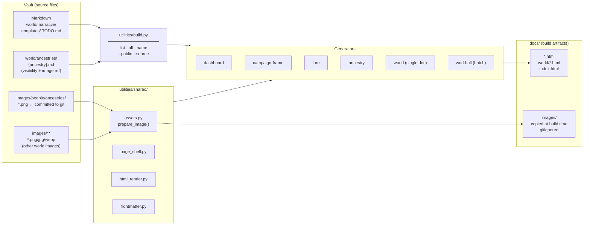

# Tarim-Shaiel Publishing Pipeline

This directory contains all Python tooling for the Tarim-Shaiel HTML publishing pipeline. The single entry point is `build.py`. Generators read Markdown source from the vault, copy any referenced images to `docs/images/`, and write styled HTML to `docs/`. Content with `visibility: gm_secrets` in frontmatter is excluded from public builds.

---

## Pipeline Overview



---

## Where Source Files Go

| Asset type | Vault location | Convention |
|---|---|---|
| Ancestry portraits | `images/people/ancestries/` | **Committed to git.** Reference in `world/ancestries/{name}.md` as `![[FILENAME.png\|250]]` (filename only — no path). |
| World / lore images | Anywhere under `images/` | **Not committed** (gitignored). Reference as `![[FILENAME.ext]]` in doc body. Generator copies to `docs/images/` at build time via `rglob()`. |
| Per-ancestry metadata | `world/ancestries/{dh_name_lowercase}.md` | YAML frontmatter sets `visibility`. First `![[image.ext]]` in body becomes the floated figure. |
| World / myth / lore docs | `world/`, `narrative/lore/`, `narrative/myth/`, etc. | Any `.md` with the correct `type:` frontmatter is a valid source. |

`docs/images/` is **gitignored** — it is a build artifact directory recreated on every run.

---

## Running Generators

### From the terminal

```bash
# See all registered generators
python utilities/build.py list

# Run the full public pipeline (matches Netlify)
python utilities/build.py all --public

# Run full pipeline with GM content (local review)
python utilities/build.py all

# Single generator
python utilities/build.py ancestry
python utilities/build.py dashboard

# Generators that need a source file
python utilities/build.py lore --source "narrative/lore/The Roads.md"
python utilities/build.py world --source world/cosmology/warrens.md
```

### From Obsidian (Shell Commands plugin)

Three commands are pre-configured — see `utilities/shell-commands-config.md` for full installation and setup instructions.

| Alias | Hotkey | What it does |
|---|---|---|
| **Regenerate HTML Preview** | Command palette (manual) | Regenerates HTML for the currently open file only. Includes GM content (no `--public`). |
| **Full Pipeline (Local)** | `Cmd+Shift+B` | Runs dashboard + campaign-frame + world-all, then opens `docs/index.html` in browser. |
| **Open Local Preview** | Command palette (manual) | Opens the already-generated HTML for the current file without regenerating. |

> Local Shell Commands **never** use `--public` — local review shows all content including GM-only docs. `--public` is applied only by Netlify and GitHub Actions.

---

## Local vs. Online Generation

| | Local (terminal / Obsidian) | GitHub Actions | Netlify |
|---|---|---|---|
| **Trigger** | Manual — `build.py` or Shell Commands hotkey | Push to `main` (or manual dispatch from GitHub UI) | Push to `main` (auto-deploy) |
| **Visibility** | All content (no `--public`) | `--public` only | `--public` only |
| **Output** | `docs/` in your local vault | Committed back to `docs/` on `main` [skip ci] | Served from `docs/` at the Netlify deploy URL |
| **Images** | Copied from vault `images/` at runtime | Copied from committed `images/people/ancestries/` | Same as GitHub Actions |
| **Config** | `utilities/build.py` | `.github/workflows/generate-html.yml` | `netlify.toml` |

**Netlify build command** (from `netlify.toml`):
```bash
python utilities/dashboard/generate_dashboard.py && \
python utilities/campaign_frame/generate_campaign_frame.py && \
python utilities/lore/generate_lore_html.py --source 'narrative/lore/The Roads.md' && \
python utilities/ancestries/generate_ancestry_html.py && \
python utilities/world/generate_all_world_html.py --public
```

---

## Generator Reference

| Name | Script | Default output | Notes |
|---|---|---|---|
| `dashboard` | `dashboard/generate_dashboard.py` | `docs/dashboard.html` | Reads `TODO.md` |
| `campaign-frame` | `campaign_frame/generate_campaign_frame.py` | `docs/campaign-frame.html` | |
| `lore` | `lore/generate_lore_html.py` | `docs/lore/` | Defaults to `narrative/lore/The Roads.md` |
| `ancestry` | `ancestries/generate_ancestry_html.py` | `docs/peoples-of-tarim-shaiel.html` | Per-ancestry files supply visibility + portrait |
| `world` | `world/generate_world_html.py` | `docs/world/` | Single doc; `--source` required |
| `world-all` | `world/generate_all_world_html.py` | `docs/world/` + index | Batch all world docs |

The **LegendKeeper pipeline** (`legendkeeper-pipeline/`) is a separate, standalone sub-pipeline. Entry point: `legendkeeper-pipeline/publish.py`.

---

## Shared Modules

| Module | Purpose |
|---|---|
| `shared/assets.py` | `prepare_image()`, `prepare_audio_wiki()` — vault rglob → copy to `docs/images/` |
| `shared/page_shell.py` | HTML page wrapper and navigation shell |
| `shared/html_render.py` | `render_prose()` — Markdown → HTML including wiki-embed rendering |
| `shared/frontmatter.py` | YAML frontmatter extraction with regex fallback |
| `shared/config.py` | Shared path constants |
| `shared/base_generator.py` | `Generator` Protocol (`name`, `description`, `run()`) |

---

## Visibility Gating

Content gating is applied at the generator level:

- **Ancestry generator**: `visibility: gm_secrets` in a per-ancestry file's YAML frontmatter → that ancestry is excluded from HTML output entirely.
- **`world-all` generator**: `--public` flag → files with `visibility: gm_secrets` are skipped.
- **Dashboard, campaign-frame, lore**: not yet gated (all content is public-safe).

`--public` is always passed in Netlify and GitHub Actions builds. Local builds omit it so the GM can review everything.
