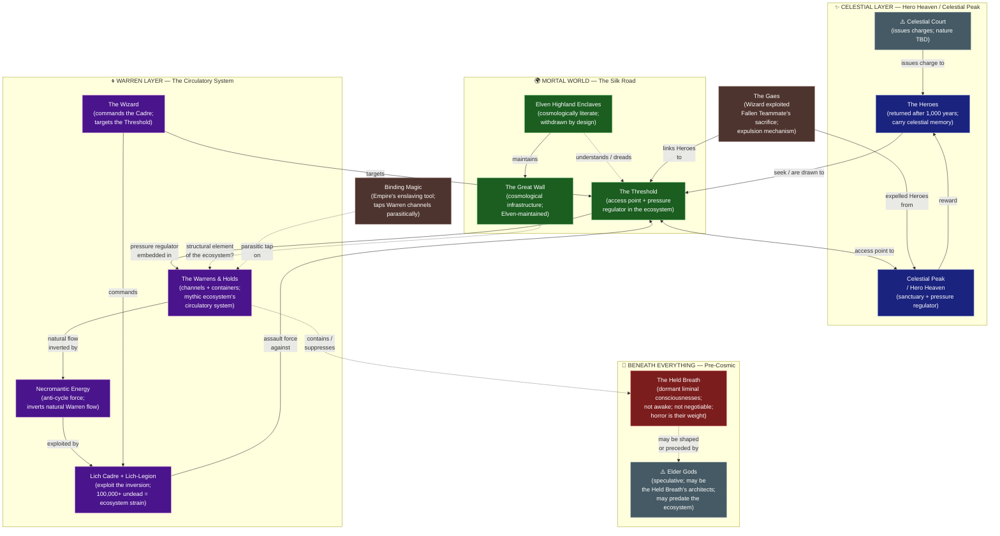

# Cosmological Architecture

> Three layers of reality, the forces that inhabit each, and the mechanisms connecting them. Decisions still pending are marked ⚠️.

---

## Layer Summary

| Layer | What Lives Here | Threat Direction |
|---|---|---|
| Celestial | Hero Heaven, Celestial Court, The Heroes | Threatened from below (Threshold breach = immediate break) |
| Mortal | Silk Road civilisations, Elven Highlands, The Threshold | Squeezed from both sides |
| Warrens | Magical infrastructure, necromantic inversion, Lich-Legion | Inverted from within; straining outward |
| Pre-cosmic | The Held Breath | Inert unless disturbed; irreversible if woken |

## Open Design Questions

- ⚠️ **Celestial Court** — governing body, impersonal accounting system, or distributed ecosystem will? See [[../../TODO]] → Divine & Cosmic Factions
- ⚠️ **Elder Gods** — same as the Elder Civilization? Architects of the ecosystem? Or something else entirely?
- ⚠️ **Warren Intelligences** — do the Warrens have agenda, or are they pure infrastructure? Decision affects Act 3

## Sources

- Full cosmological decisions → [[../../narrative/STORY_ARC_SYNTHESIS]]
- Concepts index → [[../concepts/Index]]
- Factions index (divine section) → [[../factions/Index]]
