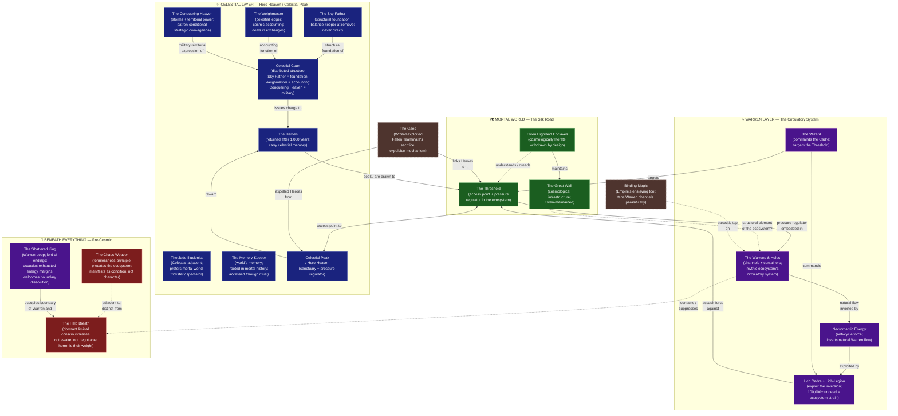

# Cosmological Architecture

> Three layers of reality, the forces that inhabit each, and the mechanisms connecting them. Decisions still pending are marked ⚠️.

```mermaid
graph TD

    subgraph CELESTIAL["✨  CELESTIAL LAYER  —  Hero Heaven / Celestial Peak"]
        CC["Celestial Court<br/>(distributed structure:<br/>Sky-Father = foundation;<br/>Weighmaster = accounting;<br/>Conquering Heaven = military)"]
        SKY["The Sky-Father<br/>(structural foundation;<br/>balance-keeper at remove;<br/>never direct)"]
        WM["The Weighmaster<br/>(celestial ledger;<br/>cosmic accounting;<br/>deals in exchanges)"]
        CH["The Conquering Heaven<br/>(storms + territorial power;<br/>patron-conditional;<br/>strategic own-agenda)"]
        JI["The Jade Illusionist<br/>(Celestial-adjacent;<br/>prefers mortal world;<br/>trickster / spectator)"]
        MK["The Memory-Keeper<br/>(world's memory;<br/>rooted in mortal history;<br/>accessed through ritual)"]
        CP["Celestial Peak<br/>/ Hero Heaven<br/>(sanctuary + pressure regulator)"]
        HEROES["The Heroes<br/>(returned after 1,000 years;<br/>carry celestial memory)"]
        SKY -->|"structural<br/>foundation of"| CC
        WM -->|"accounting<br/>function of"| CC
        CH -->|"military-territorial<br/>expression of"| CC
        CC -->|"issues charge to"| HEROES
        CP -->|"reward"| HEROES
    end

    subgraph MORTAL["🌍  MORTAL WORLD  —  The Silk Road"]
        THRESHOLD["The Threshold<br/>(access point + pressure<br/>regulator in the ecosystem)"]
        GREAT_WALL["The Great Wall<br/>(cosmological infrastructure;<br/>Elven-maintained)"]
        ELV["Elven Highland Enclaves<br/>(cosmologically literate;<br/>withdrawn by design)"]
        ELV -->|"maintains"| GREAT_WALL
        ELV -.->|"understands / dreads"| THRESHOLD
    end

    subgraph WARRENS["🌀  WARREN LAYER  —  The Circulatory System"]
        WN["The Warrens & Holds<br/>(channels + containers;<br/>mythic ecosystem's<br/>circulatory system)"]
        NECRO["Necromantic Energy<br/>(anti-cycle force;<br/>inverts natural Warren flow)"]
        LICH["Lich Cadre + Lich-Legion<br/>(exploit the inversion;<br/>100,000+ undead = ecosystem strain)"]
        WIZ["The Wizard<br/>(commands the Cadre;<br/>targets the Threshold)"]
        WN -->|"natural flow<br/>inverted by"| NECRO
        NECRO -->|"exploited by"| LICH
        WIZ -->|"commands"| LICH
    end

    subgraph BENEATH["🔴  BENEATH EVERYTHING  —  Pre-Cosmic"]
        HB["The Held Breath<br/>(dormant liminal consciousnesses;<br/>not awake; not negotiable;<br/>horror is their weight)"]
        CW["The Chaos Weaver<br/>(formlessness-principle;<br/>predates the ecosystem;<br/>manifests as condition, not character)"]
        SK["The Shattered King<br/>(Warren-deep; lord of endings;<br/>occupies exhausted-energy margins;<br/>welcomes boundary dissolution)"]
        CW -.->|"adjacent to;<br/>distinct from"| HB
        SK -->|"occupies boundary<br/>of Warren and"| HB
    end

    %% ── CROSS-LAYER CONNECTIONS ──────────────────────────────────────

    HEROES -->|"seek / are drawn to"| THRESHOLD
    THRESHOLD <-->|"access point to"| CP

    THRESHOLD -->|"pressure regulator<br/>embedded in"| WN
    GREAT_WALL -.->|"structural element<br/>of the ecosystem?"| WN

    WIZ -->|"targets"| THRESHOLD
    LICH -->|"assault force<br/>against"| THRESHOLD

    WN -.->|"contains /<br/>suppresses"| HB

    %% ── MECHANISMS ───────────────────────────────────────────────────

    GAES["The Gaes<br/>(Wizard exploited<br/>Fallen Teammate's sacrifice;<br/>expulsion mechanism)"]
    BINDING["Binding Magic<br/>(Empire's enslaving tool;<br/>taps Warren channels parasitically)"]

    GAES -->|"expelled Heroes<br/>from"| CP
    GAES -->|"links Heroes<br/>to"| THRESHOLD
    BINDING -.->|"parasitic tap<br/>on"| WN

    %% ── STYLES ───────────────────────────────────────────────────────
    classDef celestial fill:#1a237e,color:#fff,stroke:#7986cb
    classDef mortal fill:#1b5e20,color:#fff,stroke:#81c784
    classDef warren fill:#4a148c,color:#fff,stroke:#ce93d8
    classDef beneath fill:#7c1d1d,color:#fff,stroke:#ef9a9a
    classDef mechanism fill:#4e342e,color:#fff,stroke:#a1887f,stroke-dasharray:4 2
    classDef pending fill:#455a64,color:#fff,stroke:#90a4ae,stroke-dasharray:6 3

    class CC,CP,HEROES,SKY,WM,CH,JI,MK celestial
    class THRESHOLD,GREAT_WALL,ELV mortal
    class WN,NECRO,LICH,WIZ,SK warren
    class HB,CW beneath
    class GAES,BINDING mechanism
```

---

## Layer Summary

| Layer | What Lives Here | Threat Direction |
|---|---|---|
| Celestial | Hero Heaven, Celestial Court, The Heroes | Threatened from below (Threshold breach = immediate break) |
| Mortal | Silk Road civilisations, Elven Highlands, The Threshold | Squeezed from both sides |
| Warrens | Magical infrastructure, necromantic inversion, Lich-Legion | Inverted from within; straining outward |
| Pre-cosmic | The Held Breath | Inert unless disturbed; irreversible if woken |

## Resolved Design Questions

- ✅ **Celestial Court** (resolved 2026-03-19) — Distributed structure: the Sky-Father as structural foundation (the system expresses his will), the Weighmaster as its accounting function (celestial ledger), and the Conquering Heaven as its military-territorial expression. Not a governing body with a vote; a cosmological structure with distinct players whose interests partially overlap. See [[narrative/gm_secrets/DIVINE_PLAYERS]].
- ✅ **Elder Gods** (resolved 2026-03-19) — The "Elder Gods" category resolves into two distinct pre-cosmic entities: the Chaos Weaver (formlessness-principle the ecosystem was built to contain) and the Held Breath (dormant liminal consciousnesses). There is no separate Elder Gods category; the Shattered King occupies the Warren-deep/pre-cosmic boundary. See [[narrative/gm_secrets/DIVINE_PLAYERS]].

## Open Design Questions

- ⚠️ **Warren Intelligences** — do the Warrens have agenda, or are they pure infrastructure? The R/H/K reframing implies something is on the other end of that relationship. Decision affects Act III design. See [[../../TODO]].

## Sources

- Full cosmological decisions → [[../../narrative/STORY_ARC_SYNTHESIS]]
- Concepts index → [[../concepts/Index]]
- Factions index (divine section) → [[world/factions/_category]]
