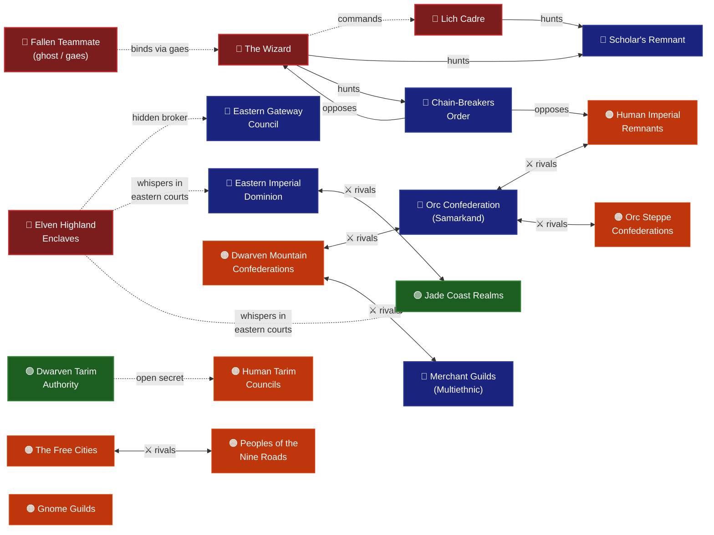

# Faction Relationship Web

> **Legend:**
> `⚔ rivals` — bidirectional tension / competition
> `-.->` — hidden or covert influence (dotted = secret)
> `-->` — active opposition / pursuit
> Node colour = narrative weight: 🔴 very-high · 🔵 high · 🟢 medium-high · 🟠 medium

---

## Notes

- Pan-regional factions (Merchant Guilds, Free Cities, Peoples of the Nine Roads, Gnome Guilds) are not shown in regional groups — they operate across all nodes
- Steppe clan sub-factions (8 named clans) are folded under `Orc Steppe Confederations` until individually named
- Subcontinent factions (Lotus Thrones, Eternal Courts, Houses of the Monsoon, Clans of the Roof) omitted — `color` status, not yet in play
- Divine/Cosmic factions (Celestial Court, Held Breath, etc.) → see [[cosmological-architecture]]
- Source data: [[../factions/Index]]
