# Historical Causal Chain

> Events in causal order, Era 0 → Campaign Present. Arrows show direct cause → effect relationships. Anticipated future events shown with dashed borders.

```mermaid
flowchart TD

    %% ── ERA 0 ────────────────────────────────────────────────────────
    E0["🔗 THE ENSLAVEMENT<br/>Era 0 · ~200 CE<br/>Human Empire enslaves Orc legions<br/>via Binding Magic; Wizard rises<br/>within imperial apparatus"]

    %% ── ERA 1 ────────────────────────────────────────────────────────
    E1A["⚡ THE LIBERATION<br/>Era 1<br/>Heroes break the binding;<br/>Orc legions freed"]
    E1B["⚔️ THE MILITARY VICTORY<br/>Era 1<br/>Imperial armies defeated;<br/>Imperial control shattered"]
    E1C["💀 THE SACRIFICE<br/>Era 1<br/>Fallen Teammate dies;<br/>death creates the Gaes mechanism<br/>(the Wizard will later exploit this)"]
    E1D["✨ THE ASCENSION<br/>Era 1<br/>Surviving Heroes ascend<br/>to Celestial Peak / Hero Heaven;<br/>charge considered complete"]
    E1E["🧙 THE WIZARD'S RETREAT<br/>Era 1<br/>Wizard escapes the military defeat;<br/>begins thousand-year contingency plan"]

    %% ── ERA 2 ────────────────────────────────────────────────────────
    E2A["🌪️ THE SCATTERING<br/>Era 2 · ~250–600 CE<br/>Imperial remnants fragment;<br/>Chaos Era begins;<br/>Orcs begin Trading Centuries"]

    %% ── ERA 3 ────────────────────────────────────────────────────────
    E3A["❓ VANISHING OF KHORASHAR<br/>Era 3 · ~900 CE<br/>Mystery event in Eastern Gateway;<br/>Elven enclave goes silent;<br/>cause unknown"]

    %% ── ERA 4–5 ──────────────────────────────────────────────────────
    E4A["📚 THE SCHOLAR'S PURGE<br/>Era 4–5 · ~1175 CE<br/>Wizard eliminates researchers<br/>with cosmological knowledge;<br/>Survivor network becomes<br/>the Scholar's Remnant"]

    E5A["⛓️ THE LICH-LEGION ASSEMBLY<br/>Era 5 · ongoing ~1000 years<br/>100,000+ undead assembled;<br/>ecosystem already strained<br/>by necromantic inversion"]

    E5B["🚪 THE EXPULSION / GAES<br/>Era 5 · ~1200 CE<br/>Wizard exploits the Gaes;<br/>Heroes expelled from<br/>Celestial Peak — 1,000 years<br/>after the Sacrifice"]

    %% ── CAMPAIGN PRESENT ─────────────────────────────────────────────
    EPRESENT["🎮 CAMPAIGN PRESENT<br/>~1200 CE<br/>Heroes return after 1,000 years;<br/>world has changed;<br/>they have not — yet"]

    %% ── ANTICIPATED (FUTURE) ─────────────────────────────────────────
    EBREACH["⚠️ THRESHOLD BREACH<br/>[anticipated]<br/>Lich-Legion assaults<br/>the Hero Heaven Threshold;<br/>ecosystem breaks immediately"]

    ERETURN["🌟 THE HEROES COMPLETE<br/>THE CHARGE<br/>[anticipated / goal]<br/>Wizard stopped;<br/>Gaes resolved;<br/>ecosystem stabilised"]

    %% ── CAUSAL LINKS ─────────────────────────────────────────────────
    E0 --> E1A
    E0 --> E1B
    E1A --> E1C
    E1B --> E1C
    E1C --> E1D
    E1C --> E1E
    E1D --> E2A
    E1B --> E2A
    E2A --> E3A
    E3A --> E4A
    E1E --> E4A
    E1E --> E5A
    E4A --> E5B
    E5A --> E5B
    E5B --> EPRESENT
    EPRESENT --> EBREACH
    EPRESENT --> ERETURN
    E5A --> EBREACH

    %% ── NOTE: LONG CAUSAL CHAIN (1000 years) ────────────────────────
    E1C -.->|"Gaes mechanism<br/>lies dormant<br/>1,000 years"| E5B

    %% ── STYLES ───────────────────────────────────────────────────────
    classDef era0 fill:#7c1d1d,color:#fff,stroke:#c62828
    classDef era1 fill:#1a237e,color:#fff,stroke:#3949ab
    classDef era2 fill:#4a148c,color:#fff,stroke:#7b1fa2
    classDef era3 fill:#004d40,color:#fff,stroke:#00897b
    classDef era45 fill:#e65100,color:#fff,stroke:#f4511e
    classDef present fill:#f9a825,color:#000,stroke:#f57f17,stroke-width:3px
    classDef anticipated fill:#37474f,color:#fff,stroke:#90a4ae,stroke-dasharray:6 3

    class E0 era0
    class E1A,E1B,E1C,E1D,E1E era1
    class E2A era2
    class E3A era3
    class E4A,E5A,E5B era45
    class EPRESENT present
    class EBREACH,ERETURN anticipated
```

---

## Era Reference

| Era | Date Equiv. | Label | Key Dynamic |
|---|---|---|---|
| Era 0 | ~200 CE | Age of Chains | Empire at height; Heroes' generation |
| Era 1 | ~200–250 CE | The Heroic Age | Liberation, sacrifice, ascension, Wizard's retreat |
| Era 2 | ~250–600 CE | The Chaos Era | Imperial collapse; Orc Trading Centuries begin |
| Era 3 | ~600–900 CE | The Stabilisation Era | Trade networks reform; mystery of Khorashar |
| Era 4–5 | ~900–1200 CE | The Long Watch | Wizard's plan matures; Scholar's Purge; Expulsion |
| Present | ~1200 CE | Campaign Present | Heroes return; world has moved on |

## Key Causal Tension

The **Sacrifice (Era 1)** and the **Expulsion (Era 5)** are separated by 1,000 years but directly connected: the Gaes created by the Fallen Teammate's death is the exact mechanism the Wizard exploits to expel the Heroes. The long dotted line between those two nodes is the spine of the entire campaign.

## Sources

- Events index → [[../events/Index]]
- Full timeline → [[../../world/content/HISTORICAL_TIMELINE]]
- Cosmological context → [[cosmological-architecture]]
